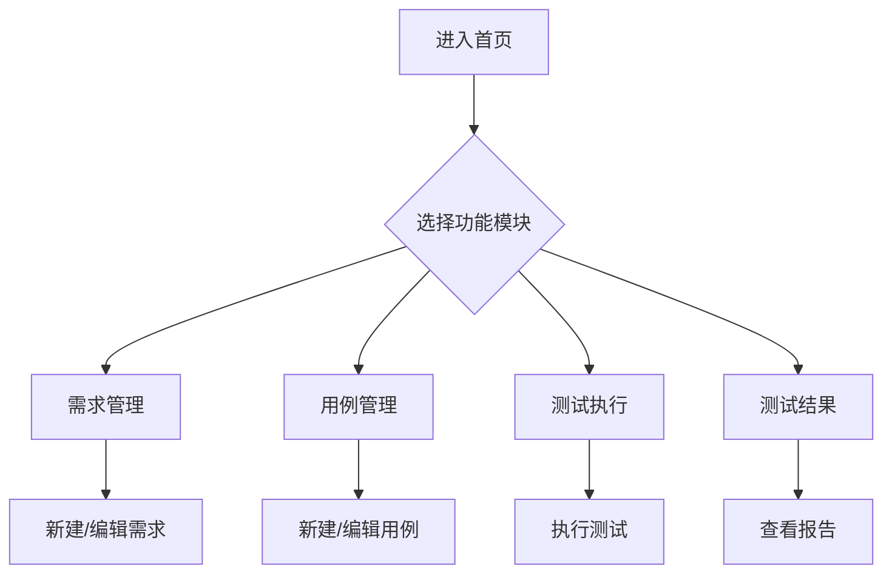

## 1. Product Overview
AI自动化测试平台是一个集成化的测试管理系统，旨在帮助测试团队高效管理测试需求、执行测试用例、分析测试结果。
- 主要用途：提供一站式测试管理解决方案，支持大语言模型集成
- 目标用户：测试工程师、测试管理者、开发人员
- 市场价值：提升测试效率，降低人工成本，支持AI辅助测试

## 2. Core Features

### 2.1 User Roles
| Role | Registration Method | Core Permissions |
|------|---------------------|------------------|
| 测试团队 | 系统预设 | 完整功能访问权限 |

### 2.2 Feature Module
1. **首页**: 平台概览、快速导航
2. **需求管理**: 需求创建、编辑、状态管理
3. **用例管理**: 测试用例编写、维护、版本管理
4. **测试执行**: 执行测试用例、记录执行结果
5. **测试结果**: 测试报告、结果分析、缺陷跟踪

### 2.3 Page Details
| Page Name | Module Name | Feature description |
|-----------|-------------|---------------------|
| 首页 | 导航侧边栏 | 固定导航菜单，支持高亮当前页 |
| 首页 | 头部栏 | 搜索、通知、用户信息、大语言模型选择 |
| 需求管理 | 需求列表 | 展示所有需求，支持筛选和搜索 |
| 需求管理 | 新建需求 | 需求标题、所属项目、模块、优先级、描述、附件上传 |
| 用例管理 | 用例列表 | 展示所有测试用例 |
| 用例管理 | 新建用例 | 用例信息录入表单 |
| 测试执行 | 执行面板 | 选择用例执行测试 |
| 测试结果 | 结果展示 | 测试报告和统计分析 |

## 3. Core Process

## 4. User Interface Design
### 4.1 Design Style
- 主色调：深蓝色系 (#1e40af)，科技感
- 辅助色：浅蓝色 (#3b82f6)，绿色 (#22c55e)，红色 (#ef4444)
- 按钮风格：圆角矩形，hover效果，状态反馈
- 字体：Inter，14-16px为主
- 布局：左侧导航 + 右侧内容区，卡片式布局
- 图标：Lucide图标库

### 4.2 Page Design Overview
| Page Name | Module Name | UI Elements |
|-----------|-------------|-------------|
| 首页 | 侧边栏 | 固定宽度200px，包含Logo和菜单项 |
| 首页 | 头部 | 搜索框、通知图标、用户头像、LLM选择器 |
| 需求管理 | 表单区域 | 标签对齐的表单布局，带必填标识 |
| 需求管理 | 编辑器 | 富文本编辑器区域 |
| 需求管理 | 附件区域 | 拖拽上传区域 |

### 4.3 Responsiveness
- 桌面优先设计
- 侧边栏可折叠
- 表单自适应宽度

### 4.4 3D Scene Guidance
- 不适用此项目