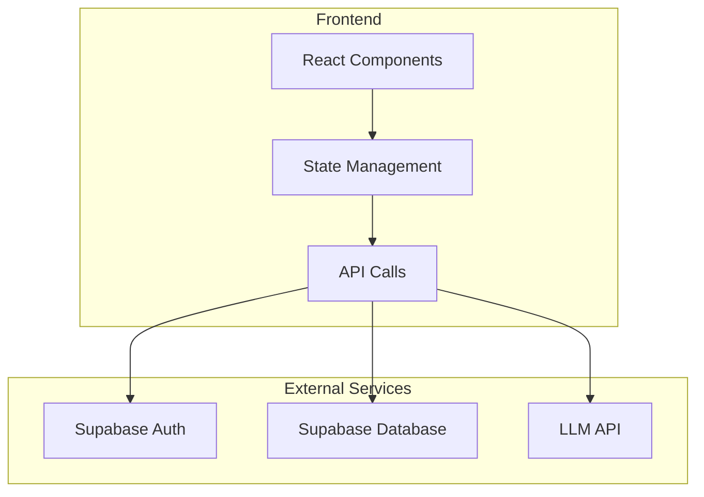
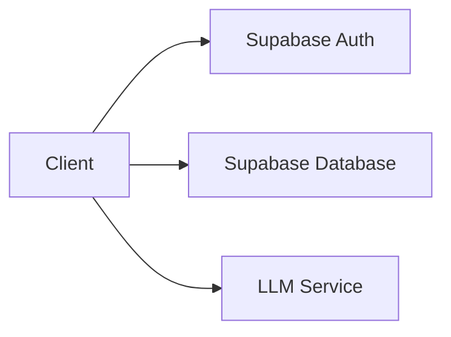
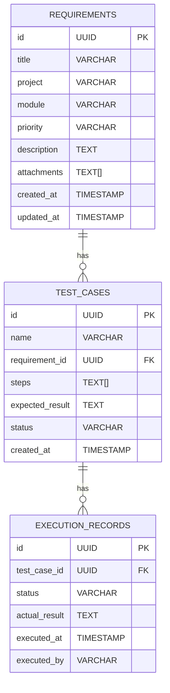

## 1. Architecture Design


## 2. Technology Description
- Frontend: React@18 + TypeScript + tailwindcss@3 + vite
- Initialization Tool: vite-init
- Backend: Supabase
- Database: Supabase (PostgreSQL)
- Icons: lucide-react

## 3. Route Definitions
| Route | Purpose |
|-------|---------|
| / | 首页 |
| /requirements | 需求管理页面 |
| /test-cases | 用例管理页面 |
| /test-execution | 测试执行页面 |
| /test-results | 测试结果页面 |

## 4. API Definitions
### 4.1 Requirements API
```typescript
interface Requirement {
  id: string;
  title: string;
  project: string;
  module: string;
  priority: '高' | '中' | '低';
  description: string;
  attachments: string[];
  createdAt: Date;
  updatedAt: Date;
}
```

### 4.2 TestCases API
```typescript
interface TestCase {
  id: string;
  name: string;
  requirementId: string;
  steps: string[];
  expectedResult: string;
  status: 'draft' | 'active' | 'archived';
  createdAt: Date;
}
```

### 4.3 TestExecution API
```typescript
interface ExecutionRecord {
  id: string;
  testCaseId: string;
  status: 'pass' | 'fail' | 'skip';
  actualResult: string;
  executedAt: Date;
  executedBy: string;
}
```

## 5. Server Architecture Diagram


## 6. Data Model
### 6.1 Data Model Definition


### 6.2 Data Definition Language
```sql
CREATE TABLE requirements (
    id UUID PRIMARY KEY DEFAULT uuid_generate_v4(),
    title VARCHAR(255) NOT NULL,
    project VARCHAR(100) NOT NULL,
    module VARCHAR(100),
    priority VARCHAR(10) NOT NULL CHECK (priority IN ('高', '中', '低')),
    description TEXT NOT NULL,
    attachments TEXT[],
    created_at TIMESTAMP DEFAULT CURRENT_TIMESTAMP,
    updated_at TIMESTAMP DEFAULT CURRENT_TIMESTAMP
);

CREATE TABLE test_cases (
    id UUID PRIMARY KEY DEFAULT uuid_generate_v4(),
    name VARCHAR(255) NOT NULL,
    requirement_id UUID REFERENCES requirements(id),
    steps TEXT[] NOT NULL,
    expected_result TEXT NOT NULL,
    status VARCHAR(20) DEFAULT 'draft',
    created_at TIMESTAMP DEFAULT CURRENT_TIMESTAMP
);

CREATE TABLE execution_records (
    id UUID PRIMARY KEY DEFAULT uuid_generate_v4(),
    test_case_id UUID REFERENCES test_cases(id),
    status VARCHAR(20) NOT NULL CHECK (status IN ('pass', 'fail', 'skip')),
    actual_result TEXT,
    executed_at TIMESTAMP DEFAULT CURRENT_TIMESTAMP,
    executed_by VARCHAR(100)
);
```